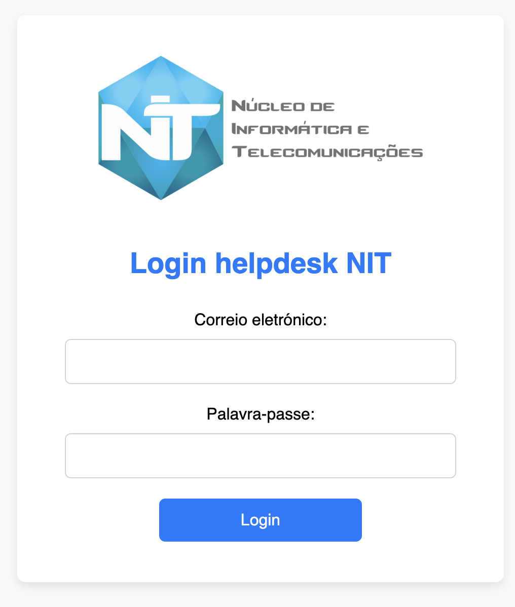
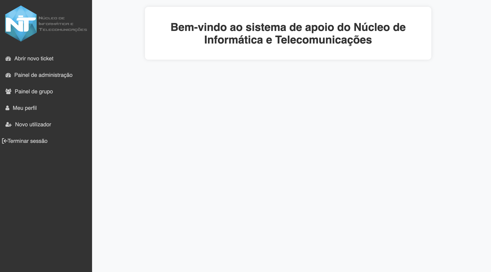

# My Personal Portfolio

Welcome to my personal portfolio! This page showcases my projects, skills, and experience in software development, following a hacker theme inspired by GitHub Pages.

## About Me

I am a passionate software developer with a knack for creating innovative solutions and a love for coding. My expertise lies in full-stack development, and I enjoy working on both front-end and back-end technologies. My goal is to build efficient, scalable, and user-friendly applications.

## Skills

- **Languages:** JavaScript, Python, Java, C++,C
- **Frameworks:** React, Node.js,Flask
- **Databases:** MariaDB, MySQL
- **Tools:** Git, Docker

## Projects

### [Project 1: Intelligent mirror room](https://github.com/username/project1)

An innovative web application designed to streamline task management. It features real-time collaboration and integrates with various third-party services.

- **Technologies:** React, Node.js, MongoDB
- **Features:**
  - Real-time updates
  - User authentication and authorization
  - Task assignment and tracking

### [Project 2: Moodle instances running on docker](https://github.com/username/project2)

The purpose of the project was to deploy N schools from a datacenter into docker containers , to be able to manage them separately , instead of being all on the same server.

- **Technologies:** Docker, shell
- **Features:**
  - Easier management and deployment
  - Integration with multiple data sources

### [Project 3: Helpdesk ticketing system](https://github.com/username/project3)

The Helpdesk Ticketing System is a web application designed to streamline the process of managing support tickets within an organization. It allows users to submit new support requests, track the status of their requests, and assign tickets to support engineers. This system aims to improve efficiency and communication in handling support issues.

- **Technologies:** MariaDB, Python, Flask, javascript, HTML , CSS
- **Features:**
  - Ticket Creation and Tracking: Allow users to easily submit support requests or report issues, and provide them with the ability to track the progress of their tickets from submission to resolution.
  - Ticket Assignment and Prioritization: Ensure tickets are assigned to the appropriate agents or teams based on workload or expertise, and prioritize them based on urgency to streamline the resolution process.
  - Knowledge Base and Self-Service Portal: Offer users access to a comprehensive knowledge base containing articles, FAQs, troubleshooting guides, and tutorials to help them resolve common issues independently through a user-friendly self-service portal.
  - Communication and Collaboration Tools: Enable seamless communication and collaboration among support agents through features such as email integration for ticket updates, internal notes for sharing insights, and collaborative tools for resolving tickets efficiently.

### [Project 4: REDA Education Platform](https://github.com/username/project2)

An AI-powered chatbot that helps users find information quickly and easily. It uses natural language processing to understand and respond to user queries.

- **Technologies:** MariaDB, Python, Flask, javascript, HTML , CSS
- **Features:**
  - Natural language understanding
  - Integration with multiple data sources
  - User-friendly interface

## Experience

### Trainee | Software Developer @NIT, Secretaria Regional da Educação,Desporto e Cultura
*Jan 2024 - Present*

- Participated on the reinstruction, development and management of moodle using docker images.
- Led the development of a Ticketing system.
- Led the development of a Education platform.

## Education

### Degree in Computers and IT Engeneering
*Universidade de Aveiro, 2023*

## Contact

Feel free to reach out to me via [email@example.com](mailto:email@example.com) or connect with me on [LinkedIn](https://linkedin.com/in/username).

---

Thank you for visiting my portfolio! Explore my projects and feel free to get in touch if you'd like to collaborate or learn more about my work.
